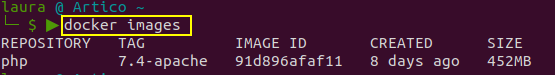
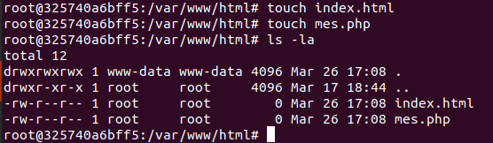
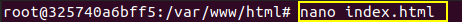
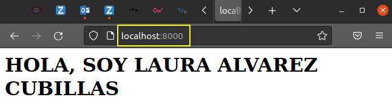
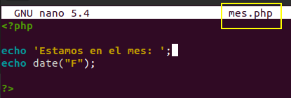
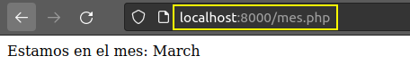
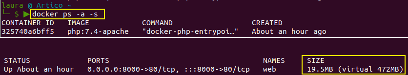

> ACTIVIDAD EVALUABLE - USO DE GIT + DOCKER - DAW Distancia
>
> Laura A. Álvarez Cubillas
>
> :link:  Video:  


# Resolución Ejercicio 1

## Servidor web

- Arrancar el contenedor `php:7.4-apache`

  - usamos -d para que quede arrancado en background
  - --name para dar nombre al contenedor
  - -p para establecer la conexión entre puertos

  ```bash
  docker run -d --name web -p 8000:80 php:7.4-apache
  ```

  

Como no tenía la imagen se la ha descargado a la vez que crea el contenedor.

Ahora ya se puede ver la imagen descargada en el equipo con el comando:

```bash
docker images
```




Comprobamos que el contenedor esta arrancado:

```bash
docker ps -a
```


Para poder trabajar en el contenedor abrimos una terminal en él con el comando `exec`:

```bash
docker exec -it web bash
```

y ahora estamos dentro del contenedor


- [x] Creamos el fichero `index.html`, para ello primero actualizo el contenedor e instalo el editor `nano` para editar los archivos que creo con el comando `touch`, la secuencia es:

```bash
apt-get update
apt-get install nano
touch index.html
touch mes.php
nano index.html
```






- [x] La salida del navegador del archivo `index.html` en el puerto establecido



- [x] Edición y visualización del archivo `mes.php` , en este caso se escribió la ruta al script en el navegador




- [x] La salida del navegador del script mes.php



- [x] Para ver el tamaño del contenedor después de crear los ficheros usamos el comando siguiente, donde el flag -s nos indica el tamaño de los contenedores que están activos, en este caso lo qu ehemos creado dentro del contenedor son 19.5 MB.

```
docker ps -a -s
```


