> Resolucion Ejercicio 1
>
> Laura A. Álvarez Cubillas
>


# Resolución Ejercicio 1

## Servidor web

- Arrancar el contenedor `php:7.4-apache`

  - usamos -d para que quede arrancado en background
  - --name para dar nombre al contenedor
  - -p para establecer la conexión entre puertos

  ```bash
  docker run -d --name web -p 8000:80 php:7.4-apache
  ```

  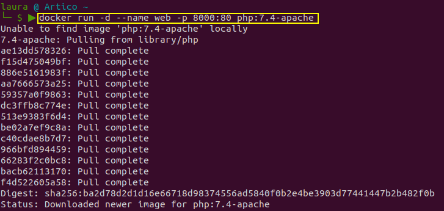

Como no tenía la imagen se la ha descargado a la vez que crea el contenedor.

Ahora ya se puede ver la imagen descargada en el equipo con el comando:

```bash
docker images
```


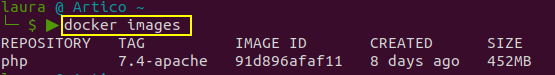

Comprobamos que el contenedor esta arrancado:

```bash
docker ps -a
```

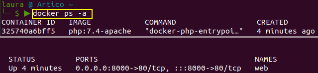

Para poder trabajar en el contenedor abrimos una terminal en él con el comando `exec`:

```bash
docker exec -it web bash
```

y ahora estamos dentro del contenedor

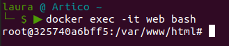

- [x] Creamos el fichero `index.html`, para ello primero actualizo el contenedor e instalo el editor `nano` para editar los archivos que creo con el comando `touch`, la secuencia es:

```bash
apt-get update
apt-get install nano
touch index.html
touch mes.php
nano index.html
```

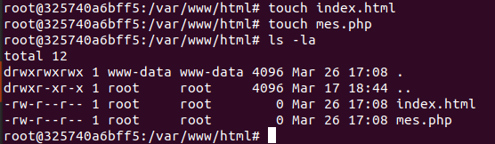


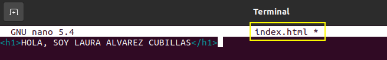


- [x] La salida del navegador del archivo `index.html` en el puerto establecido


- [x] Edición y visualización del archivo `mes.php` , en este caso se escribió la ruta al script en el navegador

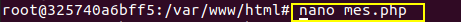

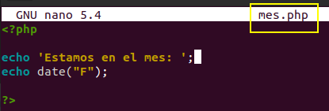

- [x] La salida del navegador del script `mes.php`

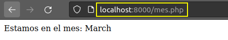

- [x] Para ver el tamaño del contenedor después de crear los ficheros usamos el comando siguiente, donde el flag -s nos indica el tamaño de los contenedores que están activos, en este caso lo qu ehemos creado dentro del contenedor son 19.5 MB.

```
docker ps -a -s
```

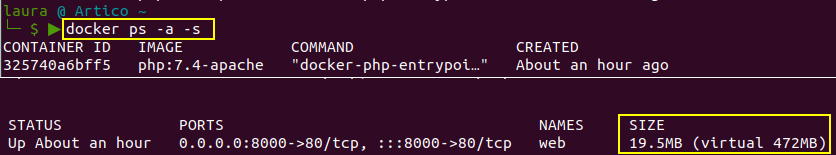

- [x] Borrado del contenedor creado `web`

  Ver apartado *Borrado de contenedores*

  

## Servidor de base de datos

Se crea el contenedor con una instancia de **mariadb** siguiendo las instrucciones de docker hub para definir las  variables de entorno solicitadas y que se cree una base de datos llamada `prueba` al iniciar la imagen.

```bash
docker run -d --name bbdd -e MARIADB_ROOT_PASSWORD=root -e MARIADB_DATABASE=prueba -e MARIADB_USER=invitado -e MARIADB_PASSWORD=invitado mariadb:latest
```

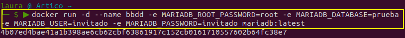

Abrimos una terminal interactiva del contenedor que esta corriendo para conectarnos a la base de datos `bbdd`

```bash
docker exec -it bbdd bash
```

y una vez en ella conectamos con la consola de la base de datos con el usuario invitado que creamos, para ello seguimos las instrucciones de docker hub

```bash
mysql -uinvitado -pinvitado
```


Desde la consola de base de datos con el comando `show databases;`vemos el listado de bases de datos, entre ellas se encuentra la base `prueba` creada al iniciar la imagen.

```mysql
show databases;
```

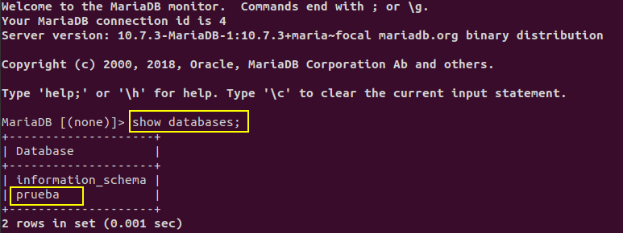

y con el comando `status;` podemos ver el usuario invitado con el que estamos conectados a la consola.

```mysql
status;	
```

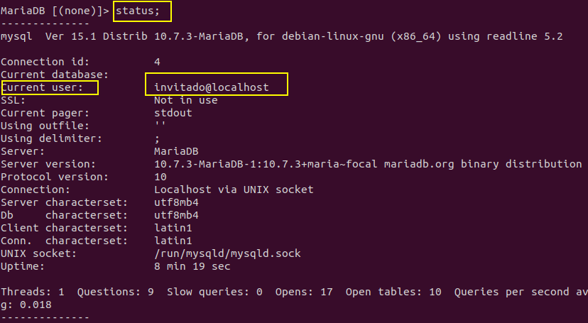

Para saber que comandos usar en la consola hice uso de `--help` 

Para salir de la consola de la base de datos se usa `exit;` 

```mysql
exit;
```

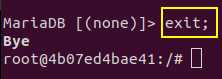


### Borrado de contenedores

Al estar el contenedor bbdd corriendo no nos permite ni borrarlo, a no ser que se fuerze el borrado, ni borrar la imagen en la que está basado. 

Con `docker ps`se ven los contenedores que hay corriendo y con los siguientes comandos se intentan borrar el contenedor y la imagen y vemos en pantalla que no podemos hacerlo y la salida del error al intentar hacerlo por estar el contenedor corriendo.

```bash
docker ps
docker rm bbdd
docker rmi mariadb
```

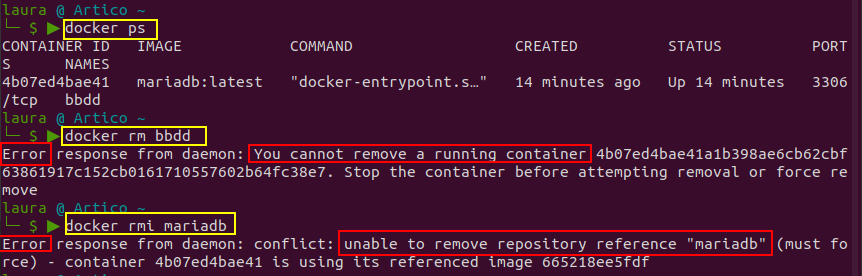

Para borrar el contenedor primero se para y luego se borra, también se podría borrar con el flag -f y forzar el borrado `docker rm -f bbdd`

```bash
docker stop bbdd
docker rm bbdd
```

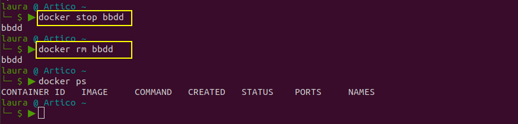

> Después de borrar el contenedor, lo volví a crear y a parar para probar si al intentar borrar la imagen daba el mismo error y efectivamente no se puede borrar la imagen en la que está basado tanto si está corriendo como si no.
>
> Al volver a borrarlo listé todos los contenedores con `docker ps -a` y me dí cuenta de que me faltaba borrar el contenedor usado en el primer apartado de esta tarea, el llamado `web`

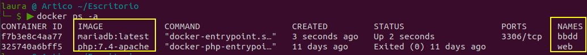

```bash
docker ps -a
docker rm web
docker rm bbdd
docker ps -a
```

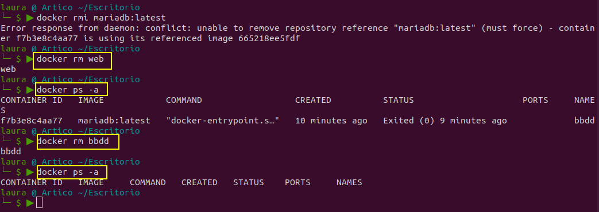

Ahora sí que están todos los contenedores borrados.

###  Imágenes en local

Las imágenes que tengo en local actualmente son:

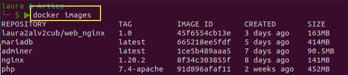

Al este el último apartado realizado de la tarea, se pueden ver todas las imágenes usadas en todos los ejercicios.
