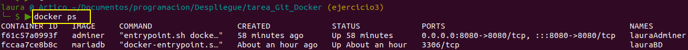
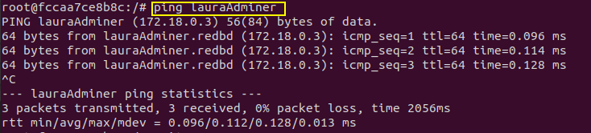
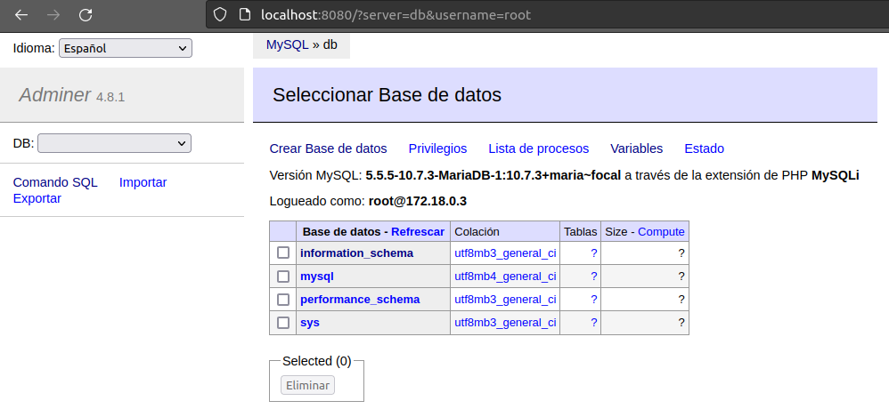

> Resolucion_Ejercicio3
>
> Laura A. Álvarez Cubillas
>


# Resolución Ejercicio 3 - REDES

## Creación de una red

Creo una red bridge propia llamada `redbd` y reviso que se crea listando las redes de docker

```bash
docker network create redbd
docker network ls
```


## Creación de contenedores en red

- [x] Creo contenedor de mariaDB en la red creada `redbd` con `--network`, asociado con `-v` a un volumen llamado `redes`y a la carpeta `/var/lib/mysql` según instrucciones de la imagen; con `--name` lo llamo `lauraBD`, con `-e` detallo las variables de entorno (en este caso solo ponemos la clave para el usuario root) y que corra en segundo plano con `-d`

  ```bash
  docker run -d --name lauraBD -v redes:/var/lib/mysql -e MARIADB_ROOT_PASSWORD=laura_pass --network redbd mariadb
  ```

  

- [x] Creo contenedor con Adminer en la misma red `redbd` para que se pueda conectar con el creado de mariaDB, este se llama `lauraAdminer`

  Además de los flag usados al crear el contenedor de mariadb ahora se usa `--link` para asociar las bases de datos `db` a gestionar con Adminar que estarán en el contenedor de MariaDB `lauraBD`, y se accede por el puerto 8080 con `-p`

  ```bash
  docker run -d --name lauraAdminer --network redbd --link lauraBD:db -p 8080:8080 adminer
  ```

  

  > al crear este contenedor no hace pull de la imagen porque hice varias pruebas primero y ya estaba la imagen en local

- [x] Podemos ver los dos contenedores corriendo con:

  ```bash
  docker ps
  ```

  

  ### Comprobaciones

- [x] Compruebo que los dos contenedores están dentro de la misma red, para ello entro en el contenedor `lauraBD` e intento ver a `lauraAdminer`

  ```bash
  docker exec -it lauraBD bash
  ```
  
  

- [x] actualizo e instalo los paquetes necesarios para hacer comprobaciones de red

  ```bash
  apt-get update
  apt-get install net-tools
  apt-get install dnsutils
  apt-get install iputils-ping
  nslookup lauraAdminer
  ping lauraAdminer




## Trabajo con los contenedores

- [x] Accedo a Adminer desde el navegador y  creo una base de datos.





- [x] Comprobación de que se ha creado la base de datos en `lauraBD`, ejecuto una terminal en ese contenedor y entramos en mysql

```bash
docker exec -it lauraBD bash
mysql -uroot -plaura_pass
show databases;
```


## Borrado contenedores, red y volumen

- [x] Primero borro los contenedores, como están corriendo fuerzo el borrado y a continuación lo compruebo

  ```bash
  docker rm -f lauraBD lauraAdminer
  docker ps
  ```
  


- [x] Borro la red y compruebo

  ```
  docker network rm redbd
  docker network ls
  ```


- [x] Borro el volumen usado y compruebo

  ```bash
  docker volume rm redes
  docker network ls
  ```

