> Resolución Ejercicio 4
>
> Laura A. Álvarez Cubillas
>


[TOC]


# Resolución Ejercicio 4 - IMAGEN CON DOCKERFILE

## Preparación

Voy a crear la imagen basada en `nginx`. Primero me bajo la imagen oficial a local, utilizaré la versión stable 1.20.2

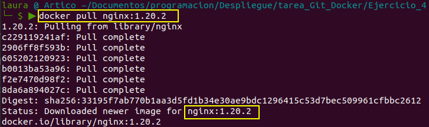

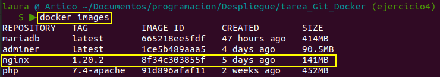

Previamente ya he creado una carpeta con la página web a desplegar en `/Ejercicio_4/para_crear_imagen`, usaré la página Costa Verde de una tarea de marcas de primero, que enlaza 3 páginas con imágenes y css propios.

Dentro de este directorio está la carpeta `public_html`con los archivos de la página web y el archivo `Dockerfile` con la configuración para crear la imagen. La explicación de esta confguración es:

```bash
FROM nginx:1.20.2 # crea la imagen propia basada en esta imagen
RUN apt-get update # ejecuta comando de actualización
ADD public_html /usr/share/nginx/html # copia todo lo contenido en la carpeta public_html al sitio por defecto de nginx
WORKDIR /usr/shar/nginx/html # directorio al que entra directamente al acceder a un contenedor de esta imagen
EXPOSE 80 # está escuchando en el puerto 80

```


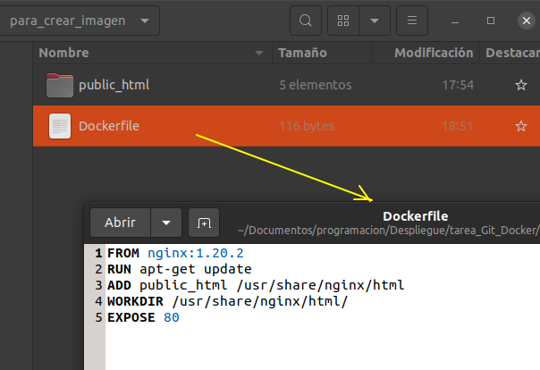

## Creación de la imagen propia

Antes de crear la imagen necesito mis datos de la cuenta de Docker Hub. Como se ve en la imagen, mi usuario es `laura2alv2cub`

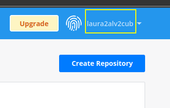

Estos datos son porque para subir una imagen a Docker Hub tiene que tener el formato `nombre_usuario/nombre_repositorio:etiqueta`En mi caso como no he creado ningún repositorio le pongo el nombre a la vez que creo la imagen, será `web_nginx` y la etiqueta con la versión 1.0

```bash
docker build -t laura2alv2cub/web_nignx:1.0 .
```

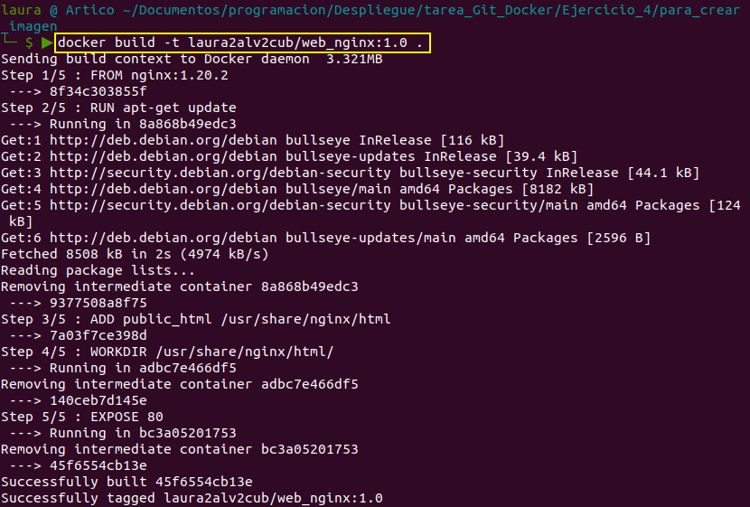

Compruebo el listado de imágenes.

```bash
docker images
```

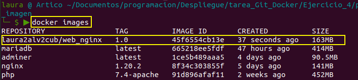

Ahora creo un contenedor de la imagen para comprobar que despliega bien la web. Uso mi puerto 8383 enlazado con el 80 de `nginx`

```bash
docker run -d --name web-nginx -p 8383:80 laura2alv2cub/web_nignx:1.0
```

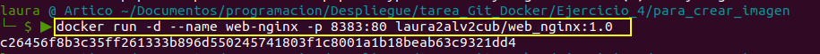

y pruebo en el navegador:

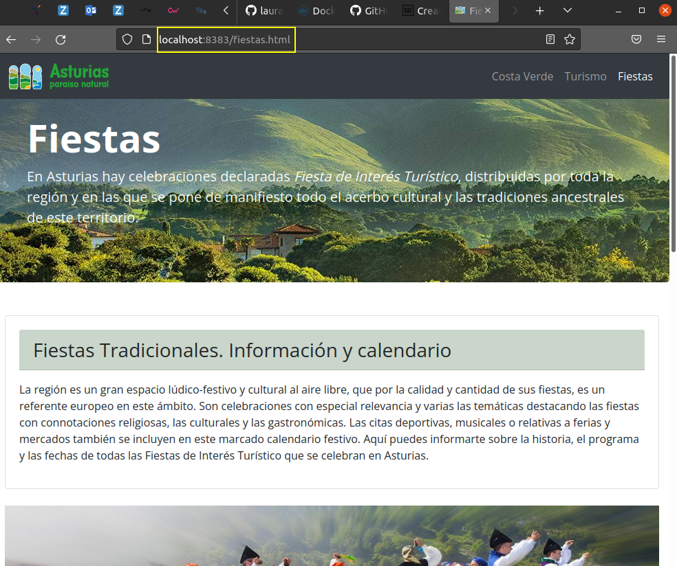

¡¡Perfecto!!  se ve la web sin problemas.

## Subir imagen a Docker Hub

En local me conecto a la cuenta de Docker Hub.

```bash
docker login 
```

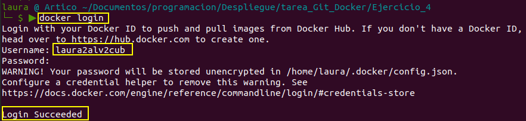

```bash
docker push laura2alv2cub/web_nignx:1.0
```

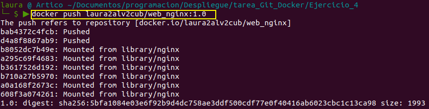


Compruebo en mi cuenta de Docker Hub que la imagen ha subido correctamente. Edito el Readme y la descripción del repositorio, que se llama web_nginx

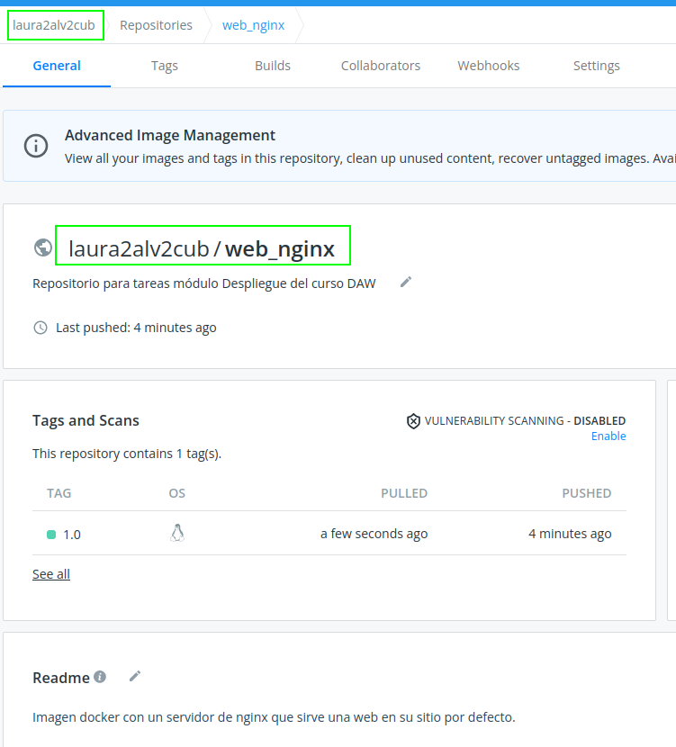